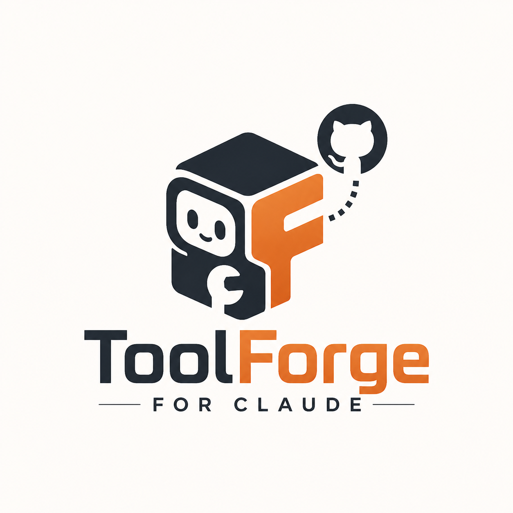
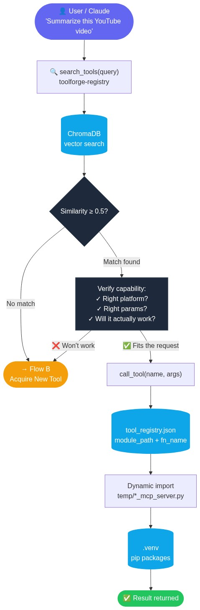
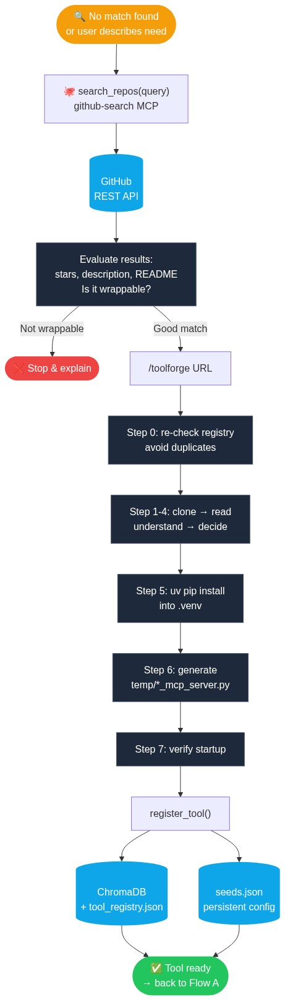

<h1 align="center">ToolForge</h1>

<p align="center">
  
</p>

<h3 align="center">为 Claude 打造的自扩展 AI 工具箱</h3>

<p align="center">
  描述你的需求——Claude 自动在 GitHub 上找到合适的库，<br/>
  封装它，并加入自己的工具库。无需手动配置。
</p>

<p align="center">
  <a href="README.md">English</a> · <a href="README.zh.md">中文</a>
</p>

---

## 目录

- [核心理念](#核心理念)
- [工作原理](#工作原理)
- [架构](#架构)
- [核心优势](#核心优势)
- [安装](#安装)
- [添加工具](#添加工具)
- [支持的仓库类型](#支持的仓库类型)

---

## 核心理念

大多数 AI 助手的能力是固定的。ToolForge 让 Claude 的能力变得动态可扩展：当 Claude 无法完成某件事时，它会自己去 GitHub 找工具、封装成 MCP 服务、注册到工具库——然后立刻使用，并在之后每次会话中持续可用。

```
"帮我总结这个 YouTube 视频"
        │
        ├─ 搜索工具库 → 没有找到 youtube 工具
        │
        ├─ 搜索 GitHub → 找到 youtube-transcript-api（10k+ stars）
        │
        ├─ /toolforge https://github.com/jdepoix/youtube-transcript-api
        │       克隆 → 阅读 → 封装 → 安装 → 注册
        │
        └─ 调用 get_transcript_text("dQw4w9WgXcQ") → 总结
```

下次再有人问 YouTube 视频，工具已经在那里了。

---

## 工作原理

每个请求都走以下两条流程之一：

<table>
  <tr>
    <th align="center">流程 A — 使用已有工具</th>
    <th align="center">流程 B — 获取新工具</th>
  </tr>
  <tr>
    <td align="center" valign="top"></td>
    <td align="center" valign="top"></td>
  </tr>
  <tr>
    <td valign="top">

**当工具可能已经存在时。**

Claude 用自然语言搜索工具库。相似度 ≥ 0.5 时，不会直接复用——而是仔细阅读描述和参数，验证工具是否真正适合当前请求（平台对不对、能力够不够、输入兼容吗）。只有确认匹配后才直接调用。如果匹配具有误导性，则进入流程 B。

  </td>
    <td valign="top">

**当没有合适工具时。**

Claude 在 GitHub 上搜索最佳库，阅读其 README 评估质量和可封装性，然后运行 `/toolforge`。该技能会克隆仓库、读懂源码、生成纯 Python 工具模块、将包安装到共享 `.venv`，并将工具注册到 ChromaDB（用于未来搜索）和 `seeds.json`（用于持久化）。工具立即可用——无需重启。

  </td>
  </tr>
</table>

---

## 架构

```
.mcp.json
│
├── toolforge-registry       ← Claude 统一交互的工具中心
│   ├── search_tools(query)  ← 通过 ChromaDB 语义搜索（all-MiniLM-L6-v2）
│   ├── call_tool(name,args) ← 动态导入并执行，无需重启
│   ├── register_tool(...)   ← 运行时添加工具到注册表和向量索引
│   └── list_all_tools()
│
├── github-search            ← 用于自主发现工具的基础设施 MCP
│   ├── search_repos(query)  ← GitHub REST API，无需 token
│   └── get_repo_readme(owner, repo)
│
├── registry/
│   ├── registry_mcp.py      ← MCP 服务器（框架代码，已纳入 git）
│   ├── seed_registry.py     ← 从 seeds.json 重建 ChromaDB
│   └── seeds.json           ← 你的个人工具配置（已加入 .gitignore）
│
├── community/               ← 预置工具，随 git 分发，所有用户共享
│   ├── *_tools.py           ← 纯 Python 工具模块（已含 14 个工具）
│   ├── seeds.json           ← 社区工具配置
│   └── requirements.txt     ← 社区工具的 pip 依赖
│
└── temp/
    └── *_tools.py           ← /toolforge 自动生成的工具模块（已加入 .gitignore）
```

无论添加多少工具，`.mcp.json` 中永远只有**两条 MCP 配置项**。

---

## 核心优势

**自主工具发现。** Claude 不需要你提供 GitHub 链接。描述需求——它自己搜索 GitHub，挑选最佳库，封装并使用。

**能力感知匹配。** 复用已有工具前，Claude 会验证工具是否真正适合当前请求——而不仅仅是描述相似。YouTube 字幕工具不会被误用于 B 站。

**单一注册入口。** 所有工具都在同一个 MCP 服务器下。Claude 通过语义搜索路由请求——无需维护一大堆 MCP 配置。

**自文档化的富工具信息。** 每个注册的工具都存储了参数名、类型、默认值和说明。Claude 从一次 `search_tools()` 结果就能正确调用工具，无需再去读源文件。

**持久化且可移植。** `seeds.json` 是唯一的事实来源。删掉向量数据库后，用 `seed_registry.py` 几秒内重建。克隆到新机器、运行安装脚本，得到完全相同的环境。

---

## 安装

### 前置条件

| 工具 | 版本 | 安装方式 |
|------|------|---------|
| [Python](https://www.python.org/downloads/) | 3.10+ | python.org |
| [uv](https://docs.astral.sh/uv/getting-started/installation/) | 最新版 | `pip install uv` |
| [git](https://git-scm.com/) | 任意版本 | git-scm.com |
| [Claude Code](https://claude.ai/code) | 最新版 | claude.ai/code |

### 方式 A — 手动安装

```bash
# 1. 克隆仓库
git clone https://github.com/shalayiding/toolforge.git
cd toolforge

# 2. 安装依赖
uv sync

# 3. 生成适配当前机器路径的 .mcp.json
uv run python setup_mcp.py
```

**4. 用 Claude Code 直接打开 `toolforge` 文件夹作为根目录** — 必须在 `toolforge` 目录层级打开，不能是父目录或子目录。这样 Claude 才能读取 `CLAUDE.md`（项目指令）和 `.claude/commands/`（`/toolforge` 技能）。

**5. 重启 Claude Code** — 这一步必须做。MCP 服务器只在启动时加载，不重启 Claude 就看不到它们。

**6. 验证两个服务器已连接** — 在 Claude Code 中运行 `/mcp`，确认看到：

```
✓ toolforge-registry
✓ github-search
```

如果缺少其中一个，重新运行 `setup_mcp.py` 再重启。

> 全新安装后注册表是空的，这是正常的。运行 `uv run python registry/seed_registry.py --community` 加载 14 个预置工具，或用 `/toolforge` 添加任意 GitHub 仓库。

### 方式 B — 让 Claude 全程安装

在运行任何命令之前，先用 Claude Code 打开 `toolforge` 文件夹，然后直接说：

```
帮我安装配置这个项目
```

Claude 会读取 `CLAUDE.md`，知道完整的安装步骤，全程引导你完成配置——包括重启提醒和 `/mcp` 验证。

### 方式 C — 加载社区预置工具

仓库内置 14 个开箱即用的工具（股票、YouTube 字幕、新闻、Mermaid 图表、OSINT），无需消耗 token：

```bash
uv run python registry/seed_registry.py --community
```

### 方式 D — 从 seeds.json 恢复个人工具

如果你有之前机器上的 `registry/seeds.json`，运行：

```bash
uv run python registry/seed_registry.py
```

几秒内重建向量数据库，所有已注册的工具全部恢复。

---

## 添加工具

**方式 A — 已知仓库地址：**
```
/toolforge https://github.com/owner/repo
```

**方式 B — 描述你的需求：**
```
我需要从 PDF 文件中提取文字
```
Claude 自动搜索 GitHub，挑选最佳库，并运行 `/toolforge`。

---

## 支持的仓库类型

- 有可导入函数的 Python 包
- CLI 工具（通过 subprocess 封装）
- HTTP API（通过 httpx 封装）

不支持：纯前端应用、纯数据集、没有可调用接口的仓库。
